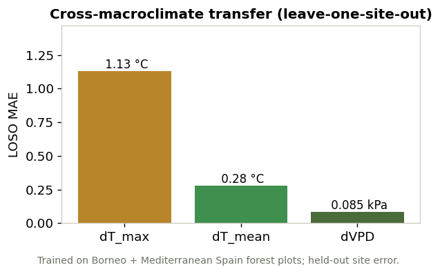
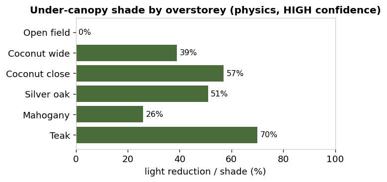
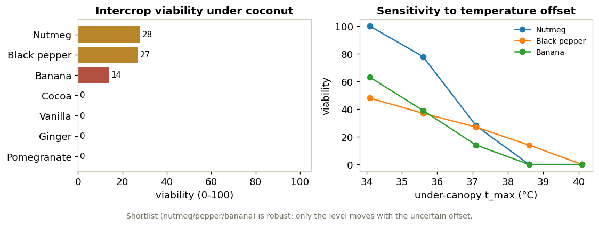
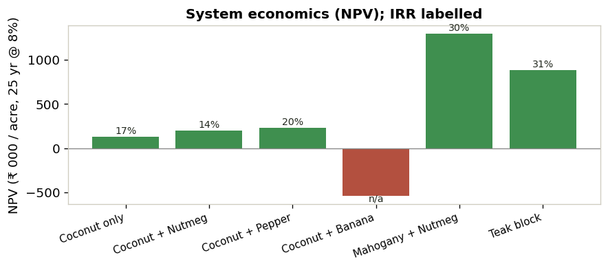
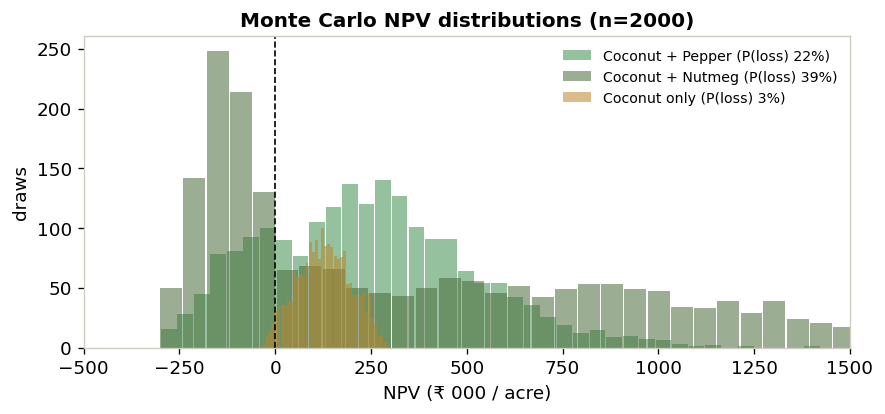
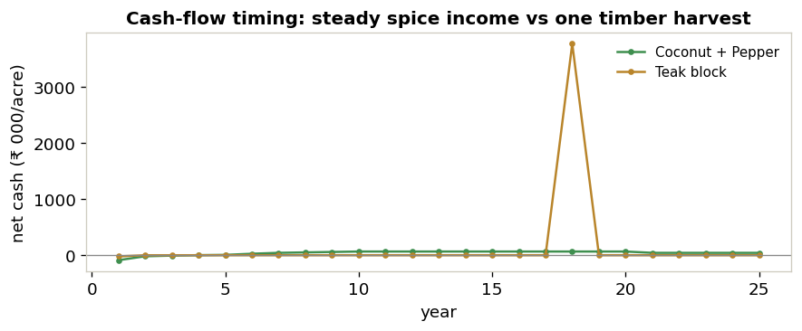

# Agroforestry Microclimate → Crop → Profit, under uncertainty

**From canopy design to crop profitability for a real smallholder farm — with calibrated, honest uncertainty at every step.**

   

This research codebase predicts the **microclimate a planned agroforestry design will create**, scores **crop suitability and disease risk** under that microclimate, runs the result through **economics and discounted cash-flow**, and **propagates uncertainty** to a profit distribution — then recommends a design. It is built for a real site, **Anaikadu (Pattukkottai), Thanjavur District, Tamil Nadu** (hot semi-arid Cauvery delta), but the method is general.

> **Headline result for Anaikadu:** coconut as the overstorey with **black pepper** (or nutmeg) intercrop clears an 8% real hurdle — **NPV ≈ ₹234k/acre, IRR ≈ 20%, payback 9 yr** — and the *choice* of crop is robust to the model's remaining temperature uncertainty. An interactive report is in [`reports/anaikadu_preprint.html`](reports/anaikadu_preprint.html).

---

## Why this exists

Conventional crop recommendation uses *regional* climate. But an agroforestry system creates its **own** microclimate, and that microclimate — not the regional average — decides what grows and what **diseases** take hold. The causal chain that actually governs profitability is:

```
Macroclimate + Farm design → Microclimate → Disease → Crop viability → Economics → Profit (with risk)
                                  ↑                                                      ↓
                         (design is controllable)                       (inverse-design optimiser)
```

The distinguishing idea is **honesty-first modelling**: every layer carries an explicit confidence level, the learned parts are validated for transfer and flagged when extrapolating, and downstream economics *propagate* that uncertainty instead of hiding it behind point estimates.

---

## The six layers

| # | Layer | Method | Confidence |
|---|---|---|---|
| 1 | design → **microclimate** | Beer–Lambert light + shelterbelt wind (physics); XGBoost **quantile** offsets for temperature/VPD + conformal intervals; **OOD** flag | physics HIGH · offset MODERATE |
| 2 | → **disease risk** | two axes — air-microclimate (foliar) + soil-water/waterlogging (soil-borne); variety susceptibility; drainage as a design lever | MODERATE |
| 3 | growth + disease → **viability** | fuzzy trapezoidal membership, Liebig limiting factor | MODERATE |
| 4 | viability → **economics** | reference yield × growth × (1−disease), banded price − validated cost; coconut + timber overstorey | MODERATE |
| 5 | → **finance** | 25-yr cash-flow with gestation/bearing/harvest timing; NPV / IRR / payback | MODERATE |
| 6 | → **uncertainty** | Monte Carlo over offset + yield + price + timber bands → NPV distribution, P(loss) | propagated |

An **inverse-design optimiser** wraps the chain to search overstorey, canopy density, windbreak and drainage for the profit-maximising design.

---

## Key findings (all figures are real pipeline output)

### 1 · The canopy→microclimate offset transfers across macroclimates

Trained on tropical Borneo (SAFE) + Mediterranean Spain (La Jarda) forest plots and tested **leave-one-site-out** (an entire site held out per fold — the honest test of transfer):



dT_mean transfers to an unseen site at **0.28 °C MAE**, with prediction-interval coverage near the 0.8 target (calibrated, not over-confident).

### 2 · Physics is trustworthy; the learned offset is flagged when extrapolating

Shade and wind come from mechanistic physics (HIGH confidence) for any candidate canopy:



The temperature offset under **coconut** is flagged **LOW (out-of-distribution)** — an open palm canopy is unlike the closed-forest training data — rather than silently extrapolated.

### 3 · The intercrop shortlist is robust to that uncertainty



Under coconut, nutmeg and black pepper lead. Sweeping the *uncertain* temperature offset across its whole plausible band changes the absolute viability but **not the shortlist** — so the decision of *which* crop to plant is actionable now; the pending data only sharpens *how well*.

### 4 · Economics and finance, validated against reality



Coconut + pepper/nutmeg clear the hurdle; banana under mature coconut is uneconomic; timber shows high *annualised* return but as a single far-off harvest (see cash-flow timing below). Costs are validated against NHB Detailed Project Reports + TNAU; prices anchored to live data.gov.in Agmarknet. *(A coconut "guaranteed loss" the model first produced was traced to a gestation-cost bug and fixed — documented in [ADR-010](docs/architectural_decision_records/ADR-010-coconut-economics-qa.md) as a validation-discipline example.)*

### 5 · Uncertainty made explicit




Monte Carlo turns every point estimate into a distribution and a probability of loss. Coconut+pepper sits mostly positive (P(loss) ≈ 22%); coconut+nutmeg is bimodal — hot draws fail the crop, cool draws pay well. The cash-flow chart shows the real trade-off: steady annual spice income vs a single distant timber harvest.

---

## Install & run (uv)

```bash
uv sync                                        # env from uv.lock
uv run pytest                                  # 22 tests

uv run python scripts/run_site.py --lat 10.4019 --lon 79.3545 --label "Anaikadu"   # end-to-end at a real point
uv run python scripts/finance_anaikadu.py      # NPV / IRR / payback per system
uv run python scripts/monte_carlo_anaikadu.py  # uncertainty distributions

uv run python scripts/export_results.py        # -> reports/results.json
uv run python scripts/make_figures.py          # -> figures/*.png
uv run python scripts/build_dashboard.py       # -> reports/anaikadu_preprint.html
```

Earth-Engine-backed scripts (`run_site.py`, the data builders) need an authenticated `earthengine-api` project; the offset/economics/finance/Monte-Carlo scripts run from the committed `data/processed/labelled_offsets.parquet` (gitignored) without network.

---

## Data

Real, openly-sourced; raw files are gitignored. Microclimate labels: **SAFE Project** Borneo (Zenodo 1228188) + gazetteer (3906082); **La Jarda**, Cádiz, Spain (Zenodo 18913503); **SAFE landscape** oil-palm rasters (Zenodo 7893600). Features via Google Earth Engine: ERA5 / ERA5-Land, SoilGrids, Copernicus DEM, MODIS LAI/NDVI, ETH canopy height, SoilTemp/SBIO. Economics: NHB DPRs, TNAU cost-of-cultivation, Salem District study, live data.gov.in Agmarknet. Provenance in [`reports/`](reports/) and the ADRs.

---

## Repo layout

```
src/agroforestry/   physics · models · predict · suitability · disease · economics · finance · monte_carlo · optimize · validation
scripts/            data builders, run_site, finance/MC/sensitivity, export_results, make_figures, build_dashboard
tests/              22 tests
docs/               architecture, modeling_blueprint, economics_layer, data_acquisition, ADRs 001–011
reports/            results.json, anaikadu_preprint.html, economics_qa, sourced inputs, catalogs
figures/            README figures (regenerated by make_figures.py)
```

See [`folder_structure.txt`](folder_structure.txt); running log in [`DEVLOG.md`](DEVLOG.md); plans in [`ROADMAP.md`](ROADMAP.md).

---

## Honest limitations

- The under-coconut **temperature offset is extrapolation** (forest-trained, open palm canopy) — flagged LOW; physics (shade/wind) and the robust shortlist carry the decision.
- A **macroclimate-transfer gap** remains: warm-night semi-arid Tamil Nadu has no close analog in the humid-tropical + Mediterranean training set.
- Economics are **MODERATE** confidence (validated vs DPRs/TNAU + live mandi prices); a clean 3-yr CEDA price series is still pending; timber prices are LOW.
- Reanalysis can't resolve the village from the town (shared ~31 km ERA5 pixel) — an **on-plot logger (year 1)** is the definitive fix and would collapse the temperature uncertainty.

Treat **comparisons** (design A vs B, crop ranking, dry vs wet timing) as reliable and absolute numbers as indicative-with-stated-uncertainty. Every modelling decision is recorded in [`docs/architectural_decision_records/`](docs/architectural_decision_records/) (ADR-001–011).

---

## Status

All six layers built, validated, and runnable (22 tests). Real data integrated across two macroclimates + an open-canopy regime. Interactive preprint report generated. Outstanding: SoilTemp / tropical-understory data requests (to firm the offset), CEDA 3-yr prices (to firm economics), and the user's own plot sensor. *Research preprint — model output with stated uncertainty, not guarantees.*
